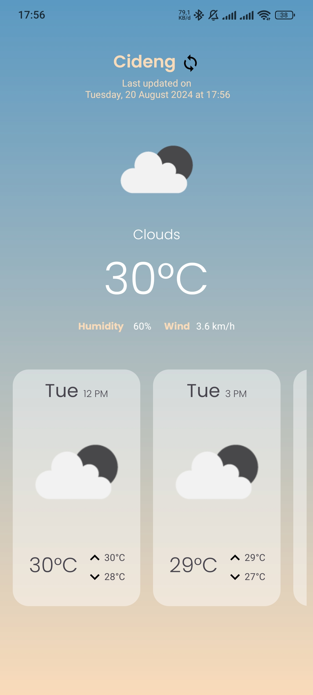
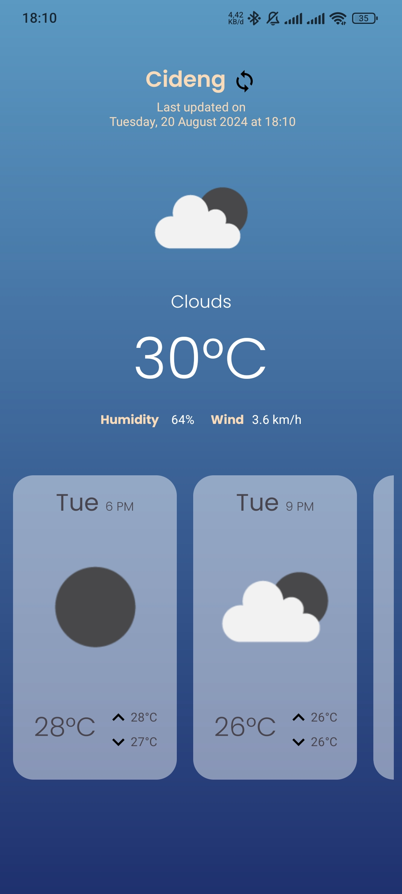

# sagara-mobile-msib-test
# CuacaLusa

<div style="display: flex; justify-content: center;">
    
    
</div>

## Fitur Utama

- Menampilkan informasi cuaca terkini berdasarkan lokasi Anda.
- Menampilkan ikon cuaca dan detail cuaca seperti suhu, kelembapan, dan kecepatan angin.
- Menyediakan ramalan cuaca tipa 3 jam untuk 3 hari ke depan.

## Persyaratan

Sebelum menjalankan aplikasi ini, pastikan Anda memenuhi persyaratan berikut:

- **Android Studio** versi terbaru terinstal di komputer Anda.
- **SDK Android** yang sesuai terinstal.
- **API Key OpenWeatherMap** untuk mengakses data cuaca (dapat diperoleh dengan **register** di [OpenWeatherMap](https://openweathermap.org/)).

## How to run

1. **Clone Repository**
   Pertama, clone repositori CuacaLusa ke komputer Anda dengan menjalankan perintah berikut di terminal atau command prompt:

   ```bash
   git clone https://github.com/cNthnael/sagara-mobile-msib-test.git
   ```

2. **Buka Proyek di Android Studio**
   - Buka Android Studio.
   - Pilih **Open an existing Android Studio project**.
   - Arahkan ke folder yang telah Anda clone dan pilih folder proyek CuacaLusa.

3. **Konfigurasi Kunci API**
   - Buka file `build.gradle` di folder `app`.
   - Ganti dengan API Key OpenWeatherMap Anda pada bagian `YOUR_API_KEY`

4. **Sync Proyek**
   - Klik tombol **Sync Now** di bagian atas layar Android Studio untuk menyinkronkan proyek dengan konfigurasi yang telah diperbarui.

5. **Jalankan Aplikasi**
   - Pilih **Run** atau tekan **Shift + F10** untuk build project dan menjalankan aplikasi di emulator atau perangkat Android yang terhubung.

6. **Periksa Izin Lokasi**
   - Pastikan aplikasi memiliki izin lokasi yang diperlukan. Aplikasi akan meminta izin lokasi saat pertama kali dijalankan jika belum diberikan.
